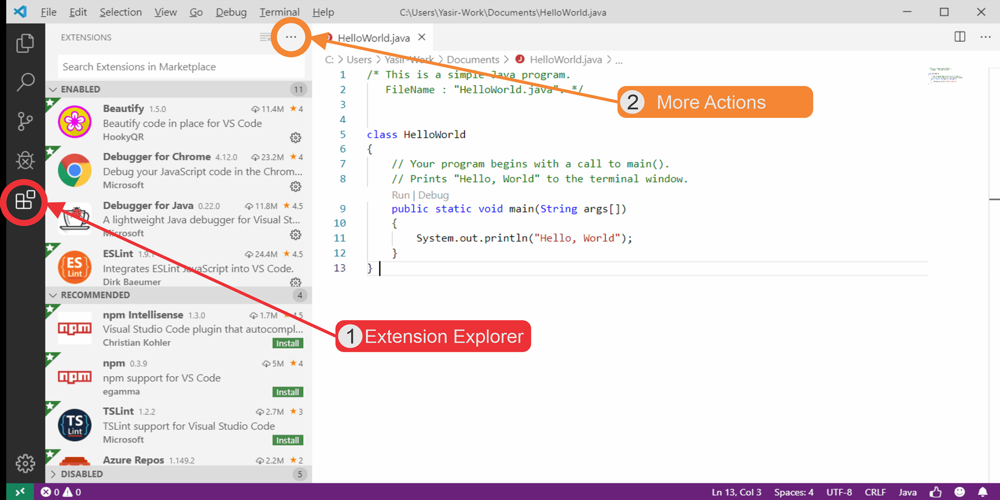
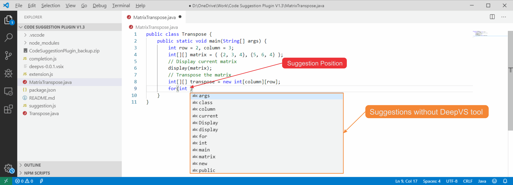

# DeepVS: A deep learning-based source code suggestion tool.

This repository contains our DeepVS tool which leverages from a deep learning-based model to suggest the next source code in an IDE. 
This version of the DeepVS tool works based on our Deep Cloud platform for the source code suggestion task. Please compile the plugin from the source to use the tool locally or for a different source code modeling task.

## DeepVS Demo

### Setup
Download the plugin provided in this repository and follow the guide illustrated below


### Usage
The DeepVs tool automatically activates after detecting a ".java" file extension. The tool provides suggestion by pressing ctrl+space.
By triggering the tool it takes source code at the current cursor position and suggests most probable next source code tokens given a context by consulting a deep learning-based pre-trained model trained on over 13M source code tokens.

### Demo



## Citation
please use the following citation if you use this work:
```
@article{hussain2019deepvs,
    title={DeepVS: An Efficient and Generic Approach for Source Code Modeling Usage},
    author={Yasir Hussain and Zhiqiu Huang and Yu Zhou and Senzhang Wang},
    year={2019},
    eprint={1910.06500},
    url = {http://arxiv.org/abs/1910.06500},
    archivePrefix={arXiv},
}
```
